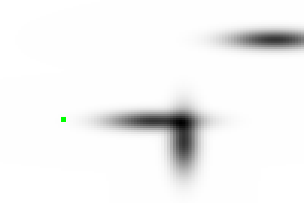

# gym-puddle

The grid-world environment with continuous state space and discrete action space described by Degris Thomas, Martha White, and Richard S. Sutton in ["Off-policy actor-critic" arXiv preprint arXiv:1205.4839 (2012)](https://arxiv.org/abs/1205.4839) for Gymnasium.

<kbd>
  
</kbd>

## Setup

The `gym-puddle` package is managed by [uv](https://docs.astral.sh/uv/getting-started/installation/). To install the package (in edit mode by default) and all its extra dependencies, do:

```shell
uv sync --all-extras
```

This will install the project and its dependencies in a virtual environment under `./.venv`.

### Running the tests

To run the pytest tests, simply do:

```shell
pytest tests/
```

## Usage

Below is a simple example of using a random policy for a maximum of 1000 time-steps.

```python

import gymnasium as gym
import gym_puddle

def main() -> None:
    seed = 43
    env = gym.make("PuddleWorld-v0", render_mode="human", goal=[0.96, 0.96])
    observation, _ = env.reset(seed=seed)

    env.action_space.seed(seed=seed)
    for _ in range(1000):
        action = env.action_space.sample()
        observation, reward, terminated, truncated, _ = env.step(action)
        env.render()

        if terminated or truncated:
            env.reset()
            break

    env.close()
```

**Notes**:

- In the above example, the agent-environment interaction is rendered visually on a canvas (since we've set the `render_mode=human`). To disable it, remove the input argument.
- To truncate the episodes after a number of time steps have elapsed, pass `max_episode_steps` to the input arguments of `make()`. Note that the caller needs to reset the environment immediately after truncation or termination (see example above).
- Rendering is fast, but disabling it will make the code even faster and is highly recommended to do for training agents.

## Off-policy actor-critic example

`examples/1_off_pac_discrete_sac.py` trains and evaluates a Discrete-SAC agent on `PuddleWorld-v0`, comparing it against a uniform-random baseline. Discrete SAC is a modern off-policy actor-critic for discrete action spaces; this is not a faithful reproduction of the 2012 Off-PAC algorithm (linear features + tile coding + GTD(λ)) — see [issue #35](https://github.com/dantp-ai/gym-puddle/issues/35) for the rationale.

The example uses [torchRL](https://github.com/pytorch/rl), available in the `rl-examples` optional extra:

```shell
uv sync --extra rl-examples
source .venv/bin/activate
python examples/1_off_pac_discrete_sac.py
```

A full run takes ~9 minutes on a laptop CPU and prints a comparison table:

```
| policy         | mean_return | mean_length | success_rate |
| -------------- | ----------- | ----------- | ------------ |
| random         |    -3149.92 |      477.98 |      12.00% |
| discrete-sac   |    -7017.06 |      395.22 |      62.00% |
```

With the default hyperparameters the agent reaches the goal in **62%** of eval episodes (vs **12%** for uniform random) — a ~5× improvement in success rate. Note that `mean_return` is *worse* than random because the learned policy commits to a direct path **through** the puddles rather than going around them; the per-step puddle penalty outweighs the gain from shorter episodes. This is a classic exploration / exploitation trade-off and tuning `TARGET_ENTROPY_WEIGHT` upward (toward 1.0) gives a smoother return-vs-success-rate curve.

| random behaviour | Discrete SAC behaviour |
|---|---|
|  |  |

(Green square = agent, black blobs = puddles. The goal is at the bottom-right corner just outside the rendered canvas with the default env config.)

## References
- https://github.com/EhsanEI/gym-puddle

- Off-Policy Actor-Critic. Thomas Degris, Martha White, Richard S. Sutton. In *Proceedings of the Twenty-Ninth International Conference on Machine Learning (ICML)*, 2012.


## Acknowledgments

- The code is based on and forked from [EhsanEI](https://github.com/EhsanEI/gym-puddle)'s implementation.
